# PopCorn Cinemateca

## Discover, organize and share movies like never before

**A modern web app for movie lovers who want to discover new films, build their personal library and share their discoveries via direct links.**

```mermaid
graph TD
    subgraph User["User"]
        U1[Accesses the app] --> U2[Filters by genre/year/rating]
        U2 -->|URL with filters| U3[Shares link]
        U3 -->|Another browser| U4[Exact same view]
    end

    subgraph App["PopCorn Cinemateca"]
        A1[React Router] --> A2[TanStack Query]
        A2 -->|Intelligent caching| A3[MSW - Simulations]
        A3 -->|Network validation| A4[Infrastructure HTTP]
        A4 -->|TMDB API| A5[Movie Catalog]
        A5 -->|Validated responses| A6[Domain Layer]
        A6 -->|Pure state| A7[Local Storage]
        A7 -->|Persistence| A8[Presentation Layer]
    end

    style User fill:#e3f2fd,stroke:#1976d2,stroke-width:2px
    style App fill:#e8f5e9,stroke:#388e3c,stroke-width:2px
```

### The Problem We Solve

Current streaming platforms are passive: they show the same thing to everyone. There's no personalized way to discover, organize and share the cinematic content that truly matters to each user.

### Our Solution

PopCorn Cinemateca is an intuitive and fast web app that:

- **Intelligent discovery**: Filter the catalog by genre, year, rating and votes
- **Personal library**: Save your favorite movies in the browser with robust validation
- **Shareable links**: Share exactly what you're watching via reproducible URLs
- **Multi-platform experience**: Works in Spanish, English and German without breaking the design

### Key Differentiators

| Feature | User Benefit |
|---|---|
| **URL filters** | Share or reproduce the exact same filtering on any device |
| **Four states per screen** | Loading, error, initial empty and empty by filter — each designed for UX |
| **Validation across three borders** | Network, local storage and URL always validated — the app never silently fails |
| **Optimized resources** | Correctly sized posters, virtualization of thousands of cards, smooth scrolling |
| **Full accessibility** | Keyboard navigation, screen readers, sufficient contrast, 200% zoom |

### Architecture That Inspires Confidence

Built with **Clean Architecture** principles:

- **Domain Layer**: Pure TypeScript, no React or Axios dependencies — 100% testable
- **Application Layer**: Ports and use cases — business logic is isolated
- **Infrastructure Layer**: Implements the ports — HTTP, API, local storage
- **Presentation Layer**: React and Tailwind — the user interface your users love

### Technology Stack

- **Vite** + **React 19** + **React Router 8** for exceptional performance
- **TanStack Query** for intelligent caching, revalidation and infinite pagination
- **Zod** for validation across the entire stack — the schema is the type
- **Tailwind CSS 4** with semantic tokens — consistent design without configuration files
- **MSW** for network edge case testing

### Success Criteria

At the end of the project, the team must demonstrate:

1. Explore the catalog with filters among thousands of results, with shareable links
2. Open a movie card where unknown budgets show "no data", no fake values
3. Save and organize their library with instant updates and automatic revert on failure
4. Test corrupt or invented data in the URL or storage without breaking the app
5. Use the entire keyboard — complete navigation, visible focus, 200% zoom without cuts
6. Another person opens the deployed URL and uses it without intervention

### Attribution and License

This product uses the TMDB API but is not endorsed or certified by TMDB. TMDB attribution is mandatory per terms of use and shown in the footer from day one.

### For Stakeholders

**Delivered in 7 days:**
- Fully functional app with professional architecture
- Code with 100% domain coverage
- Quality gate green locally and in CI
- README that a stranger can follow to get the app running

**The real value isn't the app:** it's the criterion for consuming any API with head — validating every edge, treating cache as an expiring copy, modeling impossible states outside the type, not letting a gap pass as data.

*Ideal for development teams who want to learn robust architecture while delivering a tangible, usable product.*

---

# PopCorn Cinemateca

## Descubre, organiza y comparte cine como nunca antes

**Una aplicación web moderna para los amantes del cine** que desean descubrir nuevas películas, construir su biblioteca personal y compartir sus descubrimientos mediante enlaces directos.

```mermaid
graph TD
    subgraph User["Usuario"]
        U1[Accede a la app] --> U2[Filtra por género/año/calificación]
        U2 -->|URL con filtros| U3[Comparte enlace]
        U3 -->|Otro navegador| U4[Misma vista exacta]
    end

    subgraph App["PopCorn Cinemateca"]
        A1[React Router] --> A2[TanStack Query]
        A2 -->|Caché inteligente| A3[MSW - Simulaciones]
        A3 -->|Validación de red| A4[Infrastructure HTTP]
        A4 -->|API TMDB| A5[Catálogo de películas]
        A5 -->|Respuestas validadas| A6[Layer de dominio]
        A6 -->|Estado puro| A7[Almacenamiento local]
        A7 -->|Persistencia| A8[Layer de presentación]
    end

    style User fill:#e3f2fd,stroke:#1976d2,stroke-width:2px
    style App fill:#e8f5e9,stroke:#388e3c,stroke-width:2px
```

### El Problema que Resolvemos

Las plataformas de streaming actuales son pasivas: te muestran lo mismo que a todos. No hay forma personalizada de descubrir, organizar y compartir el contenido cinematográfico que realmente importa para cada usuario.

### Nuestra Solución

PopCorn Cinemateca es una app web intuitiva y rápida que:

- **Descubrimiento inteligente**: Filtra el catálogo por género, año, calificación y votos
- **Biblioteca personal**: Guarda tus películas favoritas en el navegador con validación robusta
- **Compartir enlaces**: Comparte exactamente qué estás viendo mediante URLs reproducibles
- **Experiencia multiplataforma**: Funciona en español, inglés y alemán sin romper el diseño

### Diferenciadores Clave

| Característica | Beneficio para el usuario |
|---|---|
| **Filtros en la URL** | Comparte o reproduce exactamente el mismo filtrado en cualquier dispositivo |
| **Cuatro estados por pantalla** | Carga, error, vacío inicial y vacío por filtro — cada uno diseñado para UX |
| **Validación en los tres bordes** | Red, almacenamiento local y URL siempre validadas — la app nunca falla silenciosamente |
| **Recursos optimizados** | Pósters en tamaño correcto, virtualización de miles de tarjetas, scroll fluido |
| **Accesibilidad completa** | Navegación por teclado, lectores de pantalla, contraste suficiente, zoom al 200% |

### Arquitectura que Inspira Confianza

Construida con principios de **Clean Architecture**:

- **Layer de dominio**: TypeScript puro, sin dependencias de React ni Axios — 100% testeable
- **Layer de aplicación**: Puertos y casos de uso — la lógica de negocio está aislada
- **Layer de infraestructura**: Implementa los puertos — HTTP, API, almacenamiento local
- **Layer de presentación**: React y Tailwind — la interfaz de usuario que tus usuarios aman

### Pila Tecnológica

- **Vite** + **React 19** + **React Router 8** para un rendimiento excepcional
- **TanStack Query** para caché inteligente, revalidación y paginación infinita
- **Zod** para validación en todo el stack — la schema es el tipo
- **Tailwind CSS 4** con tokens semánticos — diseño consistente sin archivos de configuración
- **MSW** para pruebas de borde en la capa de red

### Criterios de Éxito

Al finalizar el proyecto, el equipo debe poder demostrar:

1. Explorar el catálogo con filtros entre miles de resultados, con enlaces compartibles
2. Abrir una ficha de película donde los presupuestos desconocidos dicen "sin dato", sin valores fingidos
3. Guardar y organizar su biblioteca con actualización instantánea y reversión automática en fallos
4. Probar datos corruptos o inventados en la URL o almacenamiento sin tumbar la aplicación
5. Usar todo el teclado — navegación completa, foco visible, zoom al 200% sin cortes
6. Que otra persona abra la URL desplegada y la use sin intervención

### Atribución y Licencia

Este producto usa la API de TMDB pero no está avalado ni certificado por TMDB. La atribución a TMDB es obligatoria por los términos de uso y se muestra en el pie de página desde el día 1.

### Para los Stakeholders

**Entregable en 7 días:**
- App completamente funcional con arquitectura profesional
- Código con 100% de cobertura en dominio
- Gate de calidad verde en local y CI
- README que un extraño puede seguir para poner la app en marcha

**El verdadero valor no es la app:** es el criterio para consumir cualquier API con cabeza —validar cada borde, tratar la caché como una copia que caduca, modelar los estados imposibles fuera del tipo, no dejar que un hueco se disfrace de dato.

*Ideal para equipos de desarrollo que quieren aprender arquitectura robusta mientras entregan un producto tangible y usable.*