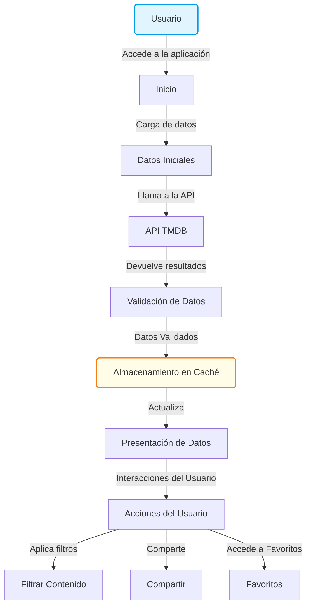
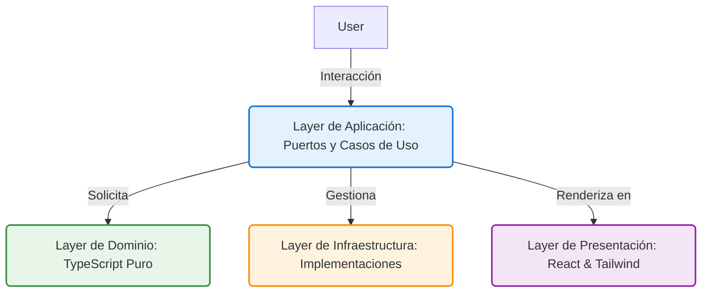

# PopCornCinemateca

## Descripción
PopCornCinemateca es una poderosa aplicación diseñada para los amantes del cine y la televisión. Nuestra plataforma permite a los usuarios descubrir, explorar y compartir una vasta biblioteca de películas y programas, utilizando una API eficiente para proporcionar información actualizada y atractiva. Diseñada con una interfaz intuitiva, PopCornCinemateca busca revolucionar la experiencia de entretenimiento en el hogar.

## Características Principales
- **Búsqueda Inteligente**: Encuentra rápidamente películas y programas con nuestra intuitiva barra de búsqueda.
- **Filtros Potentes**: Aplica múltiples filtros y encuentra exactamente lo que buscas, desde géneros hasta calificaciones.
- **Compartir Socialmente**: Facilita la compartición de tus películas y programas favoritos con amigos y familiares.
- **Lista de Favoritos**: Guarda tus películas y programas preferidos para un acceso rápido y conveniente.

## Diagrama de Cómo Funciona la App


## Diagrama de Arquitectura


## Instalación
Para poner en marcha PopCornCinemateca:
1. **Clona el repositorio**:
   ```bash
   git clone <url-del-repositorio>
   ```
2. **Accede al directorio del proyecto**:
   ```bash
   cd PopCornCinemateca
   ```
3. **Instala las dependencias**:
   ```bash
   npm install
   ```
4. **Inicia la aplicación**:
   ```bash
   npm start
   ```

## Tecnologías Utilizadas
- **React**: Base de la interfaz de usuario.
- **Tailwind CSS**: Estilización de la aplicación.
- **TypeScript**: Para un código más seguro y legible.
- **TMDB API**: Proporcionando datos cinematográficos.

## Contribuciones
Las contribuciones son bienvenidas. Para contribuir:
1. Realiza un fork del repositorio.
2. Crea tu rama de características (`git checkout -b feature/nuevaCaracteristica`).
3. Haz commit de tus cambios (`git commit -m 'Añadir nueva característica'`).
4. Haz push a la rama (`git push origin feature/nuevaCaracteristica`).
5. Abre un Pull Request.

## Contacto
Para cualquier pregunta o soporte, por favor contáctanos a:
- **Email**: soporte@popcorncinemateca.com

Con PopCornCinemateca, ¡el entretenimiento está a solo un clic de distancia!  
¡Explora, comparte y disfruta del fascinante mundo del cine!