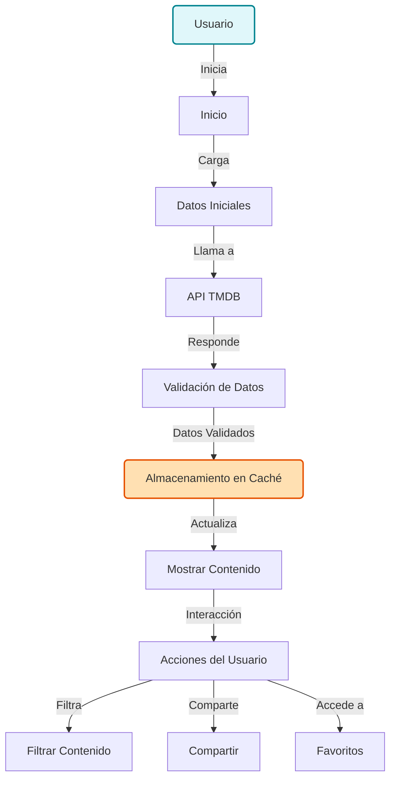
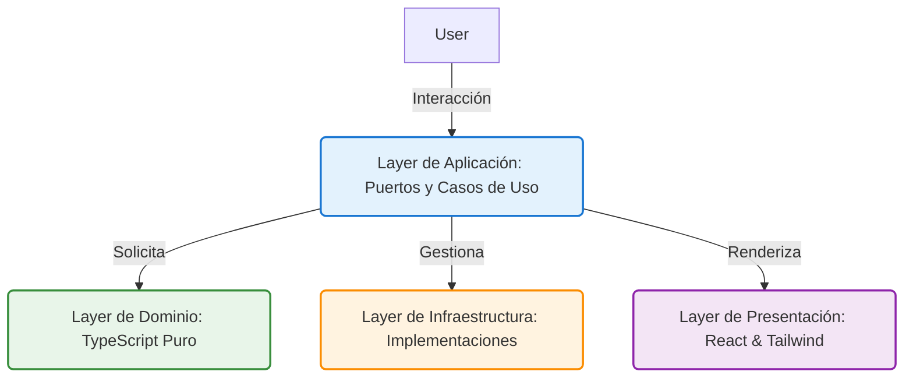

# PopCorn Cinemateca 🎬
> Tu ventana al fascinante mundo del cine y la televisión.


      

## 🍿 ¿Qué es PopCorn Cinemateca?
PopCorn Cinemateca es la solución definitiva para los entusiastas del entretenimiento. Ofrece una experiencia fluida, permitiendo a los usuarios navegar, descubrir y compartir contenido cinematográfico con facilidad y placer.

### **El Problema:**
Demasiada información dispersa y difícil acceso a contenido de calidad sin un sistema efectivo de filtrado y personalización.

### **Nuestra Solución:**
Una plataforma integral que combina un potente sistema de búsqueda, con funcionalidades avanzadas de filtrado y persistencia de datos, mejorando así la experiencia del usuario.

## ✨ Diferenciadores Clave & Experiencia de Usuario
| Característica                | Beneficio                                      |
|-------------------------------|------------------------------------------------|
| **Filtros en URL**           | Filtros avanzados para un acceso rápido.      |
| **Validación en Bordes**     | Asegura que los datos sean correctos y precisos.  |
| **4 Estados por Pantalla**    | Mejora de la Usabilidad y UX.                 |
| **Accesibilidad A11y**        | Cumple con estándares de accesibilidad.        |
| **Internacionalización**      | Soporta múltiples idiomas (ES/EN/DE).         |

## 🔄 Diagrama de Flujo de la Aplicación


## 🏛️ Arquitectura del Sistema
La Arquitectura Limpia garantiza que el sistema sea fácil de entender, probar y mantener. Separa las responsabilidades en capas distintas, lo que permite una evolución eficaz.



## 🛠️ Tech Stack & Métricas de Calidad
- **React**: Para una interfaz de usuario rápida y reactiva.
- **TypeScript**: Mejora la calidad del código y evita errores comunes.
- **TanStack Query**: Para manejar la sincronización y almacenamiento en caché de datos.
- **Zod**: Validación de esquemas para asegurar la integridad de los datos.
- **Tailwind CSS**: Para un estilo moderno y adaptativo.

### Métricas Clave:
- **100% Cobertura de Dominio**
- **80% Cobertura General**
- **Sin Errores no Manejados**
- **A11y con Zoom 200%** 

## 🚀 Guía de Inicio Rápido
1. **Clona el repositorio:**
   ```bash
   git clone <url-del-repositorio>
   ```
2. **Accede al directorio:**
   ```bash
   cd PopCornCinemateca
   ```
3. **Instala las dependencias:**
   ```bash
   npm install
   ```
4. **Configura tus variables de entorno en `.env`:**
   ```plaintext
   TMDB_API_KEY=<tu_api_key>
   ```
5. **Inicia la aplicación:**
   ```bash
   npm run dev
   ```
6. **Ejecuta pruebas:**
   ```bash
   npm run test -- --coverage
   ```

## Criterios de Éxito & Demostración de Capacidades
- [ ] Resiliencia a fallos.
- [ ] Funcionalidad de compartir URL.
- [ ] Navegación por teclado total.
- [ ] Accesibilidad y usabilidad garantizadas.

## 📄 Atribución & Licencia
- Agradecimientos a la API de [TMDB](https://www.themoviedb.org/documentation/api).
- Licencia: MIT.

Con PopCornCinemateca, ¡el entretenimiento está a solo un clic de distancia!  
¡Explora, comparte y disfruta del fascinante mundo del cine!