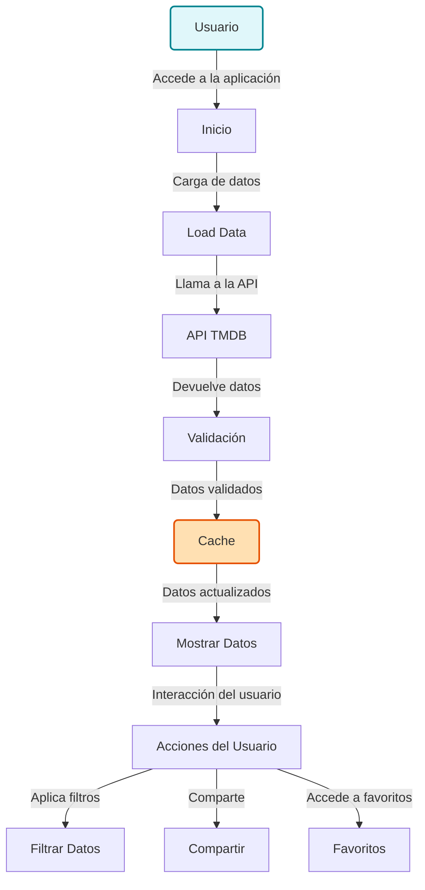

# PopCornCinemateca

## Introducción
PopCornCinemateca es una aplicación diseñada para que los amantes del cine puedan explorar, filtrar y compartir información sobre películas y programas de televisión. Nuestra plataforma utiliza una API robusta para ofrecer datos actualizados, permitiendo una experiencia de usuario fluida y atractiva.

## Características Principales
- **Explora**: Busca películas y programas de televisión fácilmente.
- **Filtra**: Aplicar filtros para encontrar exactamente lo que buscas.
- **Comparte**: Comparte enlaces a tus películas favoritas con amigos.
- **Favoritos**: Guarda tus películas y programas de televisión preferidos para fácil acceso.

## Diagrama de Cómo Funciona la App


## Diagrama de Arquitectura


## Instrucciones de Uso
Para empezar, solo sigue estos pasos:
1. Clona el repositorio.
2. Instala las dependencias:
   ```bash
   npm install
   ```
3. Inicia la aplicación:
   ```bash
   npm start
   ```

## Contacto
Para más información, preguntas o soporte, contáctanos a:
- **Email**: soporte@popcorncinemateca.com

Disfruta explorando el mundo del cine con PopCornCinemateca!