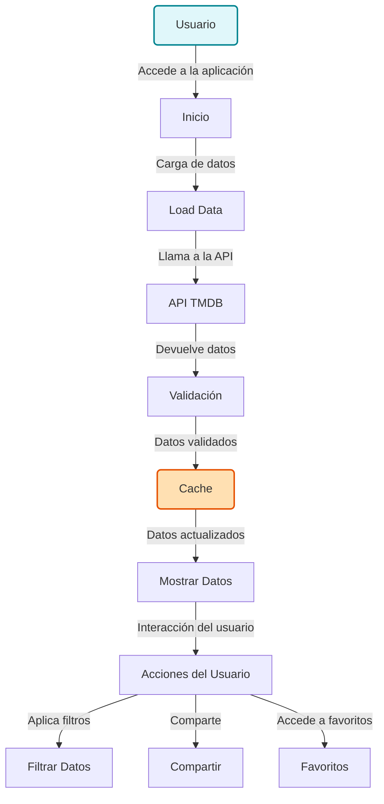

# PopCornCinemateca

## Introducción
PopCornCinemateca es una innovadora aplicación diseñada para los apasionados del cine. Con nuestra plataforma, los usuarios pueden explorar, filtrar y compartir información sobre una amplia variedad de películas y programas de televisión. Utilizamos una API robusta para ofrecer contenido actualizado y relevante, brindando a los usuarios una experiencia impecable y atractiva.

## Características Principales
- **Exploración Eficiente**: Busca y descubre películas y programas de manera fácil y rápida.
- **Filtros Personalizables**: Aplica filtros avanzados para encontrar contenido adaptado a tus preferencias.
- **Interacción Social**: Comparte tus descubrimientos con amigos y familiares de forma sencilla.
- **Acceso a Favoritos**: Guarda tus películas y programas preferidos para acceder a ellos en cualquier momento.

## Diagrama de Cómo Funciona la App


## Diagrama de Arquitectura


## Instrucciones de Uso
Para comenzar a disfrutar de PopCornCinemateca, sigue estos pasos:
1. Clona el repositorio:
   ```bash
   git clone <url-del-repositorio>
   ```
2. Instala las dependencias:
   ```bash
   npm install
   ```
3. Inicia la aplicación:
   ```bash
   npm start
   ```

## Contacto
Si tienes preguntas o necesitas soporte, no dudes en contactarnos a:
- **Email**: soporte@popcorncinemateca.com

¡Explora y disfruta del fascinante mundo del cine con PopCornCinemateca!