# PopCorn Cinemateca

## Descubre, organiza y comparte cine como nunca antes

**Una aplicación web moderna para los amantes del cine** que desean descubrir nuevas películas, construir su biblioteca personal y compartir sus descubrimientos mediante enlaces directos.

```mermaid
graph TD
    subgraph User["Usuario"]
        U1[Accede a la app] --> U2[Filtra por género/año/calificación]
        U2 -->|URL con filtros| U3[Comparte enlace]
        U3 -->|Otro navegador| U4[Misma vista exacta]
    end

    subgraph App["PopCorn Cinemateca"]
        A1[React Router] --> A2[TanStack Query]
        A2 -->|Caché inteligente| A3[MSW - Simulaciones]
        A3 -->|Validación de red| A4[Infrastructure HTTP]
        A4 -->|API TMDB| A5[Catálogo de películas]
        A5 -->|Respuestas validadas| A6[Domain Layer]
        A6 -->|Estado puro| A7[Storage Local]
        A7 -->|Persistencia| A8[Presentation Layer]
    end

    style User fill:#e3f2fd,stroke:#1976d2,stroke-width:2px
    style App fill:#e8f5e9,stroke:#388e3c,stroke-width:2px
```

### El Problema que Resolvemos

Las plataformas de streaming actuales son pasivas: te muestran lo mismo que a todos. No hay forma personalizada de descubrir, organizar y compartir el contenido cinematográfico que realmente importa para cada usuario.

### Nuestra Solución

PopCorn Cinemateca es una app web intuitiva y rápida que:

- **Descubrimiento inteligente**: Filtra el catálogo por género, año, calificación y votos
- **Biblioteca personal**: Guarda tus películas favoritas en el navegador con validación robusta
- **Compartir enlaces**: Comparte exactamente qué estás viendo mediante URLs reproducibles
- **Experiencia multiplataforma**: Funciona en español, inglés y alemán sin romper el diseño

### Diferenciadores Clave

| Característica | Beneficio para el usuario |
|---|---|
| **Filtros en la URL** | Comparte o reproduce exactamente el mismo filtrado en cualquier dispositivo |
| **Cuatro estados por pantalla** | Carga, error, vacío inicial y vacío por filtro — cada uno diseñado para UX |
| **Validación en los tres bordes** | Red, almacenamiento local y URL siempre validadas — la app nunca falla silenciosamente |
| **Recursos optimizados** | Pósters en tamaño correcto, virtualización de miles de tarjetas, scroll fluido |
| **Accesibilidad completa** | Navegación por teclado, lectores de pantalla, contraste suficiente, zoom al 200% |

### Arquitectura que Inspira Confianza

Construida con principios de **Clean Architecture**:

- **Domain Layer**: TypeScript puro, sin dependencias de React ni Axios — fácil de probar al 100%
- **Application Layer**: Puertos y casos de uso — la lógica de negocio está aislada
- **Infrastructure Layer**: Implementa los puertos — HTTP, API, almacenamiento local
- **Presentation Layer**: React y Tailwind — la interfaz de usuario que tus usuarios aman

### Pila Tecnológica

- **Vite** + **React 19** + **React Router 8** para un rendimiento excepcional
- **TanStack Query** para caché inteligente, revalidación y paginación infinita
- **Zod** para validación en todo el stack — la schema es el tipo
- **Tailwind CSS 4** con tokens semánticos — diseño consistente sin archivos de configuración
- **MSW** para pruebas de borde en la capa de red

### Criterios de Éxito

Al finalizar el proyecto, el equipo debe poder demostrar:

1. Explorar el catálogo con filtros entre miles de resultados, con enlaces compartibles
2. Abrir una ficha de película donde los presupuestos desconocidos dicen "sin dato"
3. Guardar y organizar su biblioteca con actualización instantánea y reversión automática
4. Probar datos corruptos o inventados en la URL o almacenamiento sin tumbar la aplicación
5. Usar todo el teclado — navegación completa, foco visible, zoom al 200% sin cortes
6. Que otra persona abra la URL desplegada y la use sin intervención

### Atribución y Licencia

Este producto usa la API de TMDB pero no está avalado ni certificado por TMDB. La atribución a TMDB es obligatoria por los términos de uso.

### Para los Stakeholders

**Entregable en 7 días:**
- App completamente funcional con arquitectura profesional
- Código con 100% de cobertura en dominio
- Gate de calidad verde en local y CI
- README que un extraño puede seguir para poner la app en marcha

**El verdadero valor no es la app:** es el criterio para consumir cualquier API con cabeza —validar cada borde, tratar la caché como una copia que caduca, modelar los estados imposibles fuera del tipo, no dejar que un hueco se disfrace de dato.

*Ideal para equipos de desarrollo que quieren aprender arquitectura robusta mientras entregan un producto tangible y usable.*