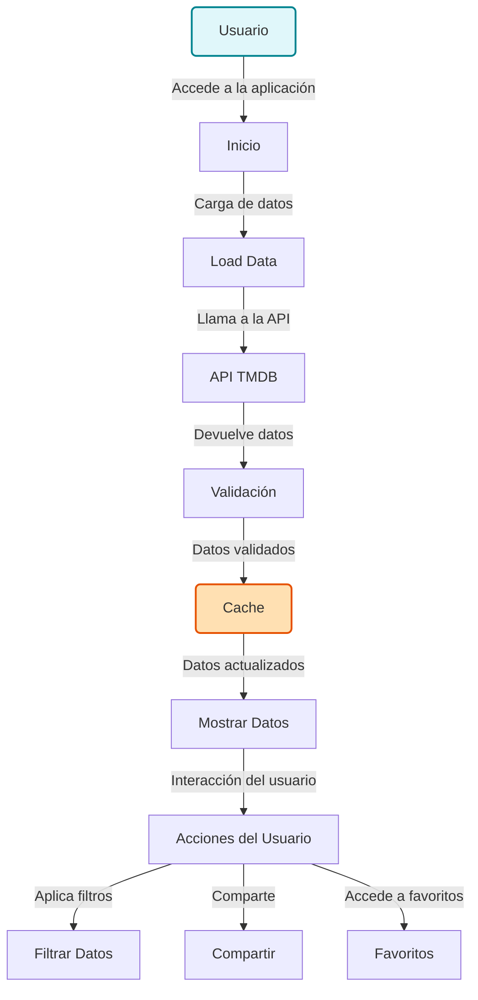

# PopCornCinemateca

## Introducción
PopCornCinemateca es una plataforma de vanguardia diseñada para los entusiastas del cine y la televisión. Esta aplicación permite a los usuarios descubrir, explorar y compartir una vasta colección de películas y programas de televisión, aprovechando una API confiable y bien documentada. Con un enfoque en la experiencia del usuario, buscamos transformar la forma en que accedes y disfrutas del contenido audiovisual.

## Características Principales
- **Búsqueda Eficaz**: Encuentra rápidamente películas y programas usando nuestra interfaz intuitiva.
- **Filtros Avanzados**: Personaliza tu búsqueda mediante filtros que te permiten encontrar exactamente lo que deseas.
- **Función de Compartir**: Comparte fácilmente enlaces a películas y programas con amigos y familiares.
- **Favoritos**: Guarda tus títulos preferidos y accede a ellos de manera instantánea.

## Diagrama de Cómo Funciona la App


## Diagrama de Arquitectura


## Instrucciones de Uso
Para comenzar a disfrutar de PopCornCinemateca:
1. **Clona el repositorio**:
   ```bash
   git clone <url-del-repositorio>
   ```
2. **Instala las dependencias**:
   ```bash
   npm install
   ```
3. **Inicia la aplicación**:
   ```bash
   npm start
   ```

## Preguntas Frecuentes (FAQs)
**¿Es PopCornCinemateca gratuita?**  
Sí, puedes acceder a todas las funcionalidades sin costo alguno.  

**¿Qué tipo de contenido puedo encontrar?**  
Ofrecemos una amplia variedad de películas y programas de televisión de diferentes géneros y épocas.  

## Contacto
Si tienes alguna pregunta o necesitas asistencia técnica, no dudes en contactar:
- **Email**: soporte@popcorncinemateca.com

¡Explora y disfruta del fascinante mundo del cine con PopCornCinemateca!